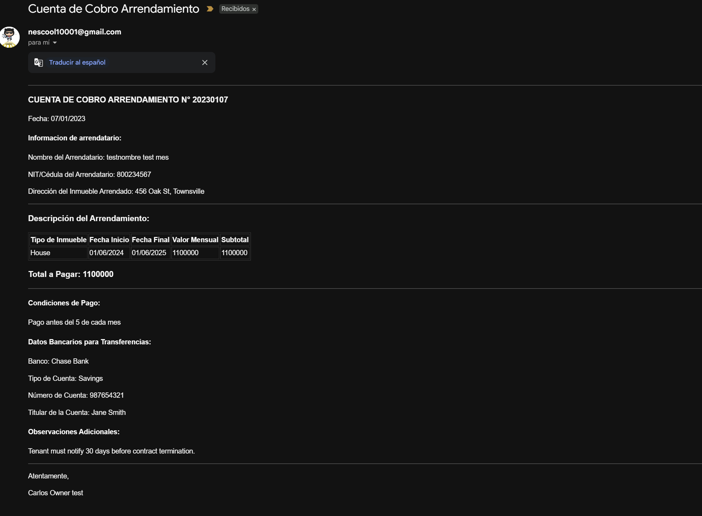

# Rent Manager

Rent Manager is a simple, self-hosted application designed to automate the process of sending rent reminders and anniversary notifications to tenants. It's built with Go and is perfect for landlords or property managers who want to streamline their rent collection process.

## Features

- **Automated Monthly Reminders:** Automatically sends rent reminders to tenants every month.
- **Anniversary Notifications:** Sends a notification to both the tenant and the landlord on the anniversary of the lease.
- **HTML Email Templates:** Uses clean and professional HTML templates for emails.
- **Manual Trigger:** Provides an API endpoint to manually trigger email notifications.
- **Easy Configuration:** Simple setup using a `.env` file and a `payers.json` file.

## Screenshot

Here is a screenshot of the email that is sent to the tenants:



## API Endpoints

The application exposes the following API endpoint:

- **`GET /validate_email`**: Manually triggers the email notification service to send reminders to all tenants.

    **Example using curl:**
    ```bash
    curl http://localhost:8080/validate_email
    ```

## Getting Started

### Prerequisites

- Go (version 1.15 or higher)
- A Gmail account with an "App Password" (or any other SMTP server)

### Installation

1.  **Clone the repository:**
    ```bash
    git clone https://github.com/your-username/rentManagerPublic.git
    cd rentManagerPublic
    ```

2.  **Create a `.env` file:**
    Create a file named `.env` in the root of the project and add the following environment variables. You can use the `.envExample.txt` as a reference.

    ```
    MAIL_HOST=smtp.gmail.com
    MAIL_PORT=587
    MAIL_USERNAME=your-email@gmail.com
    MAIL_PASSWORD=your-gmail-app-password
    SERVER_PORT=8080
    ```

3.  **Create a `payers.json` file:**
    Create a `payers.json` file in the root of the project. This file will store the information about your tenants. Here's an example of the structure:

    ```json
    [
      {
        "name": "John Doe",
        "phone": "123-456-7890",
        "rental_email": "tenant@example.com",
        "rental_date": "2023-01-15T00:00:00Z",
        "renter_name": "Jane Smith",
        "renter_email": "landlord@example.com",
        "nit": "123456789",
        "property_address": "123 Main St, Anytown",
        "property_type": "Apartment",
        "rental_start": "2023-01-15T00:00:00Z",
        "rental_end": "2024-01-14T00:00:00Z",
        "monthly_rent": 1200,
        "bank_name": "Any Bank",
        "account_type": "Checking",
        "bank_account_number": "1234567890",
        "account_holder": "Jane Smith",
        "payment_terms": "First day of the month",
        "additional_notes": "No pets allowed",
        "unpaid_months": 0
      }
    ]
    ```

4.  **Run the application:**
    ```bash
    go run main.go
    ```
    The application will start, and the scheduler will be running in the background.

## Project Structure
```
rentManagerPublic/
├── controller/
│   └── http_controller.go  # Handles HTTP requests
├── service/
│   ├── rent_service.go     # Contains the business logic for sending emails
│   └── scheduler.go        # Manages the cron job for monthly reminders
├── storage/
│   └── storage.go          # Handles reading and writing to payers.json
├── model/
│   └── payer.go            # Defines the Payer data structure
├── main.go                 # Entry point of the application
├── go.mod
├── go.sum
├── payers.json             # Database of tenants
├── .env.example            # Example environment file
└── README.md
```

## Contributing

Pull requests are welcome. For major changes, please open an issue first to discuss what you would like to change.
